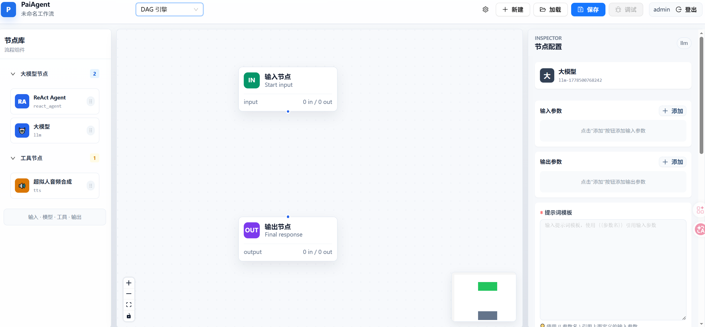
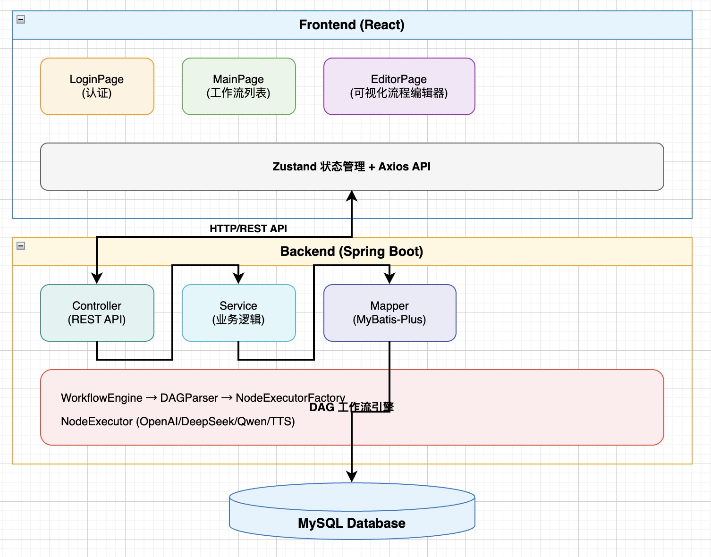

<div align="center">

# PaiAgent

**AI Agent 工作流可视化编排平台**

一个面向 AI 工作流和 Agent 编排实践的全栈项目，支持通过拖拽节点构建、执行和调试 AI 任务流程。

[](https://www.oracle.com/java/)
[](https://spring.io/projects/spring-boot)
[](https://spring.io/projects/spring-ai)
[](https://github.com/bsorrentino/langgraph4j)
[](https://reactjs.org/)
[](https://www.typescriptlang.org/)

[项目简介](#项目简介) | [核心功能](#核心功能) | [技术栈](#技术栈) | [快速开始](#快速开始) | [报名材料说明](#报名材料说明)

</div>

---

## 项目简介

PaiAgent 是一个 AI Agent 工作流可视化编排平台，支持用户通过拖拽节点的方式构建 AI 任务流程。系统提供输入节点、LLM 节点、工具节点、输出节点等基础能力，并通过自研 DAG 引擎和 LangGraph4j 状态图引擎完成任务调度。

项目重点实践 Spring AI 多模型接入、工作流编排、SSE 实时日志推送和 Agent 技能系统，适合作为 AI 全栈、Agent 工程化和 Java 后端结合大模型应用的学习与展示项目。

## 为什么做这个项目

单一 RAG 问答系统通常只覆盖“检索 + 生成”的链路，而真实 AI 应用往往还需要任务拆解、步骤编排、工具调用、过程观测和结果复用。PaiAgent 尝试把这些能力抽象为可视化工作流，让不同模型节点、工具节点和技能节点可以组合成完整的 Agent 执行流程。

这个项目主要用于验证三个方向：

- Java 后端如何接入和管理多种大模型能力。
- 前端如何提供可视化、可调试的 Agent 工作流编辑体验。
- Agent 工作流如何做到可编排、可执行、可观测和可扩展。

## 核心功能

### 可视化工作流编辑

- 基于 ReactFlow 实现节点拖拽、连线、布局和参数配置。
- 支持输入节点、LLM 节点、工具节点、输出节点等基础节点类型。
- 前端提供工作流编辑、保存、调试和执行结果查看能力。

### 多模型统一调用

- 基于 Spring AI 封装统一的大模型调用层。
- 支持 OpenAI 兼容协议模型，例如 OpenAI、DeepSeek、智谱等。
- 支持通义千问等模型服务的接入能力。
- 节点可独立配置模型、API 地址、API Key、温度等参数。

### DAG 工作流执行

- 后端将前端工作流配置解析为节点和边结构。
- 通过拓扑排序确定节点执行顺序。
- 通过循环检测避免非法流程造成执行阻塞。
- 上游节点输出可以作为下游节点输入，实现数据流转。

### LangGraph4j 状态图引擎

- 接入 LangGraph4j 作为第二套工作流执行引擎。
- 支持以状态图方式组织更复杂的 Agent 流程。
- 通过适配器复用已有节点执行逻辑，降低双引擎维护成本。

### SSE 实时执行日志

- 工作流执行过程中实时推送节点状态、模型输出和错误信息。
- 前端调试面板可以查看每个节点的执行过程。
- 便于观察 Agent 工作流的中间状态，而不是只看到最终结果。

### Skills 技能系统

- 使用 Markdown + YAML Frontmatter 描述可复用技能。
- 支持技能摘要、技能详情和引用文档的渐进式加载。
- 将技能能力暴露给模型调用流程，用于扩展 Agent 的任务处理边界。

## 技术栈

| 层级 | 技术 | 说明 |
| --- | --- | --- |
| 前端 | React 18、TypeScript、Vite | 页面开发与构建 |
| 流程编辑 | ReactFlow | 可视化节点编排 |
| UI 与状态 | Ant Design、Zustand | 组件与状态管理 |
| 后端 | Java 21、Spring Boot 3.4.1 | 业务接口与工作流服务 |
| AI 调用 | Spring AI 1.0.0-M5、Spring AI Alibaba | 多模型统一接入 |
| 工作流引擎 | 自研 DAG 引擎、LangGraph4j | 节点调度与状态图编排 |
| 数据存储 | MySQL、Redis、MinIO | 工作流配置、缓存和文件存储 |
| 通信 | REST API、SSE | 接口调用与实时日志推送 |

## 系统架构

```text
┌──────────────────────────────────────────────┐
│                  前端层                       │
│ React + TypeScript + ReactFlow + Ant Design  │
│ 工作流编辑 / 节点配置 / 调试面板 / 日志展示     │
└──────────────────────┬───────────────────────┘
                       │ REST API / SSE
┌──────────────────────┴───────────────────────┐
│                  应用层                       │
│ Spring Boot Controller / Service / Auth       │
│ 工作流管理 / 执行记录 / 用户认证                │
└──────────────────────┬───────────────────────┘
                       │
┌──────────────────────┴───────────────────────┐
│                工作流引擎层                    │
│ DAG Engine / LangGraph4j / EngineSelector     │
│ 拓扑排序 / 状态图 / 节点调度 / 事件回调          │
└──────────────────────┬───────────────────────┘
                       │
┌──────────────────────┴───────────────────────┐
│                  AI 能力层                    │
│ Spring AI / ChatClientFactory / Skills        │
│ 多模型调用 / Prompt 模板 / 技能加载             │
└──────────────────────┬───────────────────────┘
                       │
┌──────────────────────┴───────────────────────┐
│                  数据层                       │
│ MySQL / Redis / MinIO                         │
│ 工作流配置 / 执行记录 / 缓存 / 文件存储          │
└──────────────────────────────────────────────┘
```

## 功能演示


### 工作流绘制



### SSE 实时反馈


### 系统架构图



## 快速开始

### 环境要求

| 工具 | 版本要求 |
| --- | --- |
| Java | 21+ |
| Maven | 3.8+ |
| Node.js | 18+ |
| MySQL | 8.0+ |
| Redis | 6.0+ |

### 1. 克隆项目

```bash
git clone https://github.com/guocfu/PaiAgent.git
cd PaiAgent
```

### 2. 初始化数据库

```sql
CREATE DATABASE paiagent DEFAULT CHARACTER SET utf8mb4 COLLATE utf8mb4_unicode_ci;
```

导入初始化脚本：

```bash
mysql -u root -p paiagent < backend/src/main/resources/schema.sql
```

### 3. 配置后端环境变量

```bash
cd backend
cp .env.example .env
```

按本地环境修改 `.env`：

```env
SERVER_PORT=8084
MYSQL_HOST=localhost
MYSQL_PORT=3306
MYSQL_DATABASE=paiagent
MYSQL_USERNAME=root
MYSQL_PASSWORD=your_mysql_password_here
REDIS_HOST=localhost
REDIS_PORT=6379
JWT_SECRET=your_jwt_secret_key_minimum_32_characters
OPENAI_API_KEY=sk-your-openai-api-key-here
```

### 4. 启动后端

```bash
cd backend
./mvnw spring-boot:run
```

后端默认地址：

```text
http://localhost:8084
```

### 5. 启动前端

```bash
cd frontend
cp .env.example .env.local
npm install
npm run dev
```

前端默认地址：

```text
http://localhost:5173
```

### 6. 开发环境默认账户

| 用户名 | 密码 |
| --- | --- |
| admin | admin123 |

> 默认账户仅用于本地开发测试，公开部署前应通过环境变量修改或禁用。

## 典型使用流程

1. 登录系统，进入工作流列表。
2. 创建一个新的 AI 工作流。
3. 在画布中拖拽输入节点、LLM 节点、工具节点和输出节点。
4. 配置模型参数、Prompt 模板和节点输入输出关系。
5. 点击调试或执行，观察节点状态和 SSE 实时日志。
6. 查看最终输出，并根据中间日志调整节点配置。

示例流程：

```text
[输入节点] -> [LLM 分析节点] -> [技能处理节点] -> [输出节点]
```

## 核心实现亮点

- 使用 Spring Boot 设计工作流、节点、执行记录等后端接口，形成完整的 AI 工作流管理链路。
- 基于 ReactFlow 实现可视化节点拖拽、连线和参数配置，让 Agent 流程可以直观编辑。
- 基于 Spring AI 封装统一 LLM 调用层，支持 OpenAI 兼容模型和通义千问等模型。
- 实现 DAG 工作流执行逻辑，支持拓扑排序、循环检测和节点间数据传递。
- 接入 LangGraph4j，探索状态图方式的 Agent 工作流编排。
- 使用 SSE 将节点执行状态和模型输出实时推送到前端，提升调试体验和过程可观测性。
- 设计 Skills 技能系统，用 Markdown/YAML 描述可复用的 Agent 能力。

## 项目结构

```text
PaiAgent/
├── backend/                 # Spring Boot 后端服务
│   ├── src/main/java/       # 业务代码
│   ├── src/main/resources/  # 配置、SQL、技能资源
│   ├── .env.example         # 后端环境变量模板
│   └── pom.xml              # Maven 配置
├── frontend/                # React 前端应用
│   ├── src/components/      # 流程编辑、节点面板、调试面板等组件
│   ├── src/pages/           # 登录页、主页、编辑器页
│   ├── src/store/           # Zustand 状态管理
│   ├── src/api/             # API 调用封装
│   └── package.json         # 前端依赖与脚本
├── docs/                    # 项目说明与开发文档
├── image/                   # README 截图与架构图
└── README.md                # 项目说明
```

## 后续规划

- 增加更多工具节点，例如网页检索、文档解析、结构化抽取和数据导出。
- 完善条件分支、循环节点和子工作流能力。
- 增加典型 Agent 模板，例如竞品分析、简历优化、代码审查、内容生成。
- 优化执行记录查询和失败重试机制。
- 补充单元测试、接口测试和端到端演示脚本。
